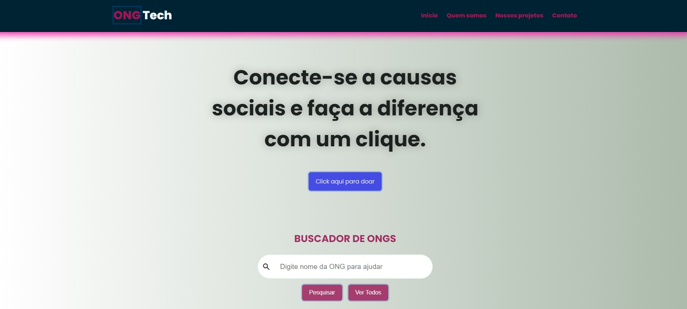
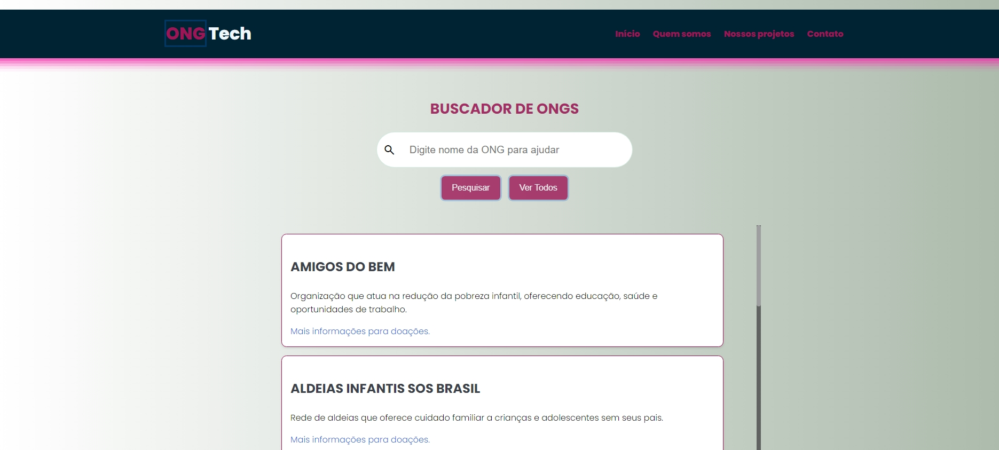
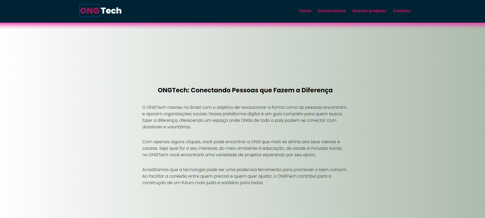
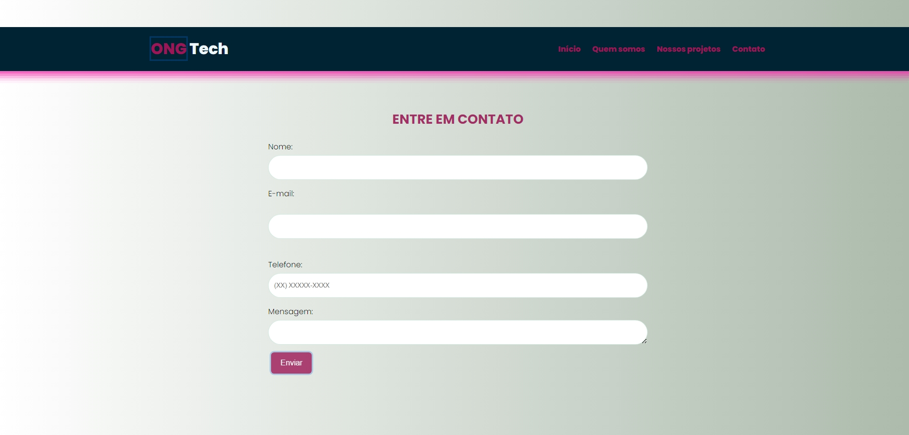

# Projeto Feito durante a Imersão Dev Alura + Google Gemini
##### Projeto feito no evento da Alura + Google, além do conhecimento obtidos nas aulas do evento, foi usando o Gemini IA para criar ideias ajudar no codigo e construir os textos.
* [Ir para o site ONGTech](https://talilotarlison.github.io/ongtech-imersao-dev-google-gemini-main/)
## ONGTech: Conectando Pessoas e Causas
## Sobre a ONGTech
A ONGTech é uma plataforma digital brasileira que visa revolucionar a forma como as pessoas encontram e apoiam organizações sociais. Nossa missão é criar um ecossistema colaborativo onde ONGs de todo o país possam conectar-se com doadores e voluntários, amplificando o impacto social.

## Principais Características
* **Busca personalizada:** Encontre ONGs que se alinham aos seus valores e interesses.
* **Perfil detalhado de ONGs:** Conheça a história, projetos e impacto de cada organização.
* **Ferramentas de doação:** Faça doações seguras e transparentes.
* **Plataforma de voluntariado:** Encontre oportunidades para fazer a diferença.
* **Site Responsivo:** Celular, Pc, Tablet

## Como Funciona
1. **Agregador de busca:** Facilitamos sua busca para o bem.
2. **Busca:** Utilize os filtros para encontrar ONGs que te interessam.
3. **Conecte-se:** Entre em contato com as ONGs para saber mais sobre seus projetos.
4. **Ajude:** Faça uma doação ou se torne um voluntário.

## Tecnologias Utilizadas
* **HTML5:** Estrutura da página
* **CSS3:** Estilização visual
* **JavaScript (ES6):** Lógica de busca, interação com o usuário e manipulação do DOM
* **Gemini Google:** IA do Google.
* **GitHub:** Para salvar o codigo.

## Screenshots






## Contribua com a ONGTech
Quer ajudar a construir um futuro melhor? Contribua com o nosso projeto no GitHub: [link para o repositório]

## Contato
Para mais informações, entre em contato conosco:
* **Email:** contato@ongtech.com.br
* **Facebook:** [link para o perfil da ONGTech no Facebook]
* **Instagram:** [link para o perfil da ONGTech no Instagram]

## Estrutura do Projeto
```markdown
projeto-ongtech/
├── index.html
|  assets  ├──css/ |──  style.css
|     |    ├── js/ |── script.js
|     |──  |── bd/ ├── bd.js
|          ├── pages/
|          │   ├── sobre.html
|          │   ├── contato.html
|          │   └── ...
└── README.md
```
